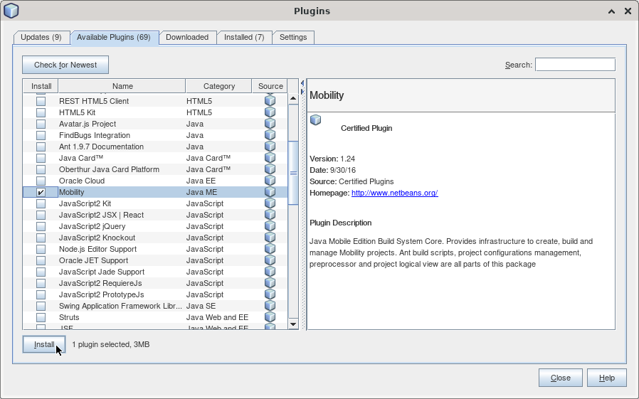
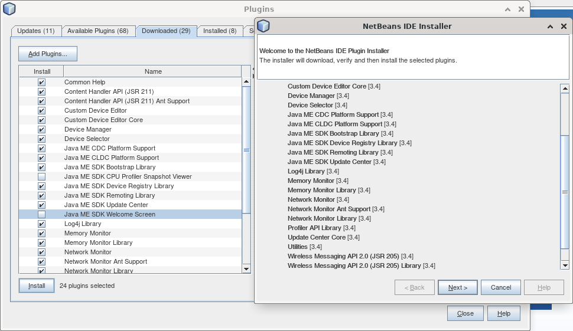
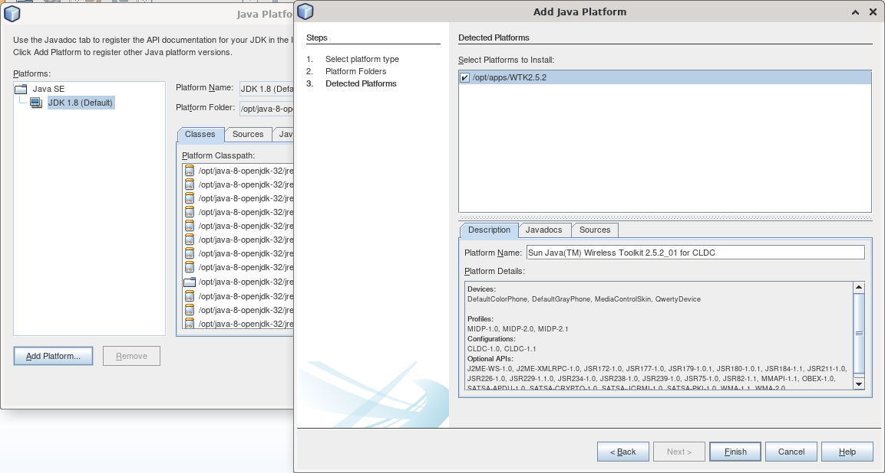
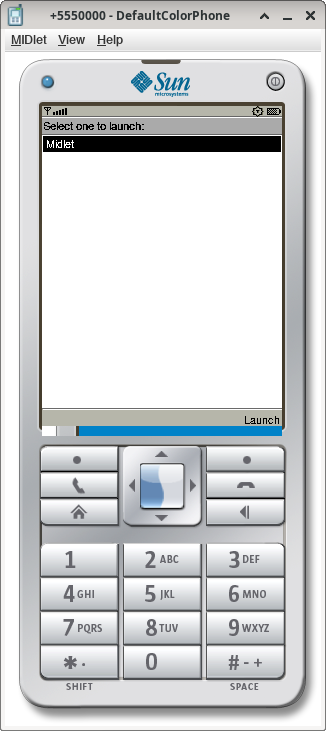

**Welcome Hack Club Retrospect refugees!**

If you're not from Hack Club and you're trying to build a J2ME application in 2025, I question your motives but here's the most up to guide on the internet for it.

For Arch see [Rafflesia's guide](https://github.com/ProgrammerIn-wonderland/Setting-Up-j2me-in-2025-archlinux/). Most of this guide was adapted from it.

# Guide

## Install a 32 bit JDK
Extract [this tarball file](https://files.mercurywork.shop/rafflesia/java-8-openjdk-32.tar.gz) and move it to wherever you want, you'll need it for the WTK.

## Enable Multilib
Run `sudo apt-get install libxtst6:i386 libxt6:i386 libxrender1:i386 libxi6:i386`

> [!NOTE]
> You may need to add the i386 architecture first via `sudo dpkg --add-architecture i386`. Make sure to update your repositories afterwards with `sudo aptitude update`.

## Download Sun Wireless Toolkit
Download and install the [Sun Java Wireless Toolkit](https://files.mercurywork.shop/foxmoss/retrospect/sun_java_wireless_toolkit-2.5.2_01-linuxi486.bin.sh). It'll ask you for your Java location, point it to where you installed the JDK and append `/bin` to the path.

## Download plugins 
Download [this ZIP file](https://files.mercurywork.shop/rafflesia/oracle-jmesdk-3-4-rr-nb-plugins.zip) containing JME plugins and extract it into its own folder, you'll need it later.

## Installing Mobility
Install Netbeans 8.2. This typically requires an Oracle account, but linked [here](https://files.mercurywork.shop/rafflesia/netbeans-8.2-linux.sh) is a script that will let you install it without one.
1. Run the installer linked above with `--javahome` specifying the java-8-openjdk-32 you installed. It'll list packs and runtimes it will install, only the following are necessary:
	* Base IDE
	* Java SE
	* Java ME
2. Finish installation
3. Open Tools > Plugins
4. Install the **Mobility** plugin. It will prompt you to verify the certificates, just ignore it and click Continue.

## Installing the other plugins you need
1. Still in Tools > Plugins, open the Downloaded tab
2. Select all the plugins from the zip file you used earlier except for the following:
    - Java ME SDK CPU Profiler Snapshot Viewer
    - Profiler (Java ME Projects Support)
    - Profiler Ant Support
    - Toolbar core
    - Java ME SDK Welcome Screen.

The installer will once again ask you to verify certificates, you can ignore it as before. After the plugins finish installing, you will be prompted to restart your IDE. Make sure "Restart IDE Now" is selected and click Finish.

## Setting the platform
1. Go back to the main page and select Tools > Java Platforms
2. Click `Add Platform`
3. Select Platform Type: Java ME CLDC Emulators
4. Select the location of where you installed the Wireless Toolkit to
5. Proceed and finish

> [!NOTE]
> If this fails, try setting your `WTK_JRE_PATH="/usr/lib/jvm/java-8-openjdk-32/"` environment variable, and then restarting NetBeans. If this works, you can add it to `/etc/environment`

## Creating your first project
* The examples plugin didn't install for you most likely, but I have extracted the Samples and put them in `Samples/` of this repo
* You can also just create a new project (Box icon), select Java ME, and have your fun that way

# Notes
* The run button works perfectly unlike those suckers on Arch :P
* I didn't test this guide exactly in this order, but its still the correct steps to my knowledge
